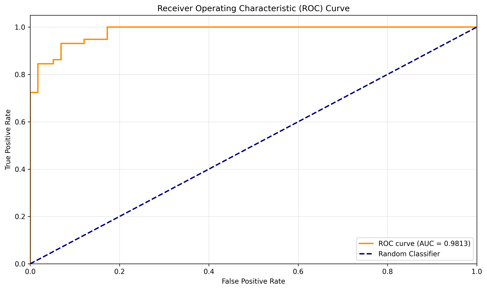
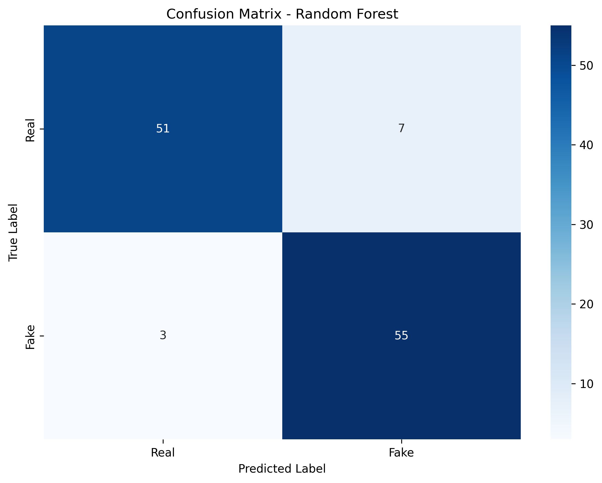
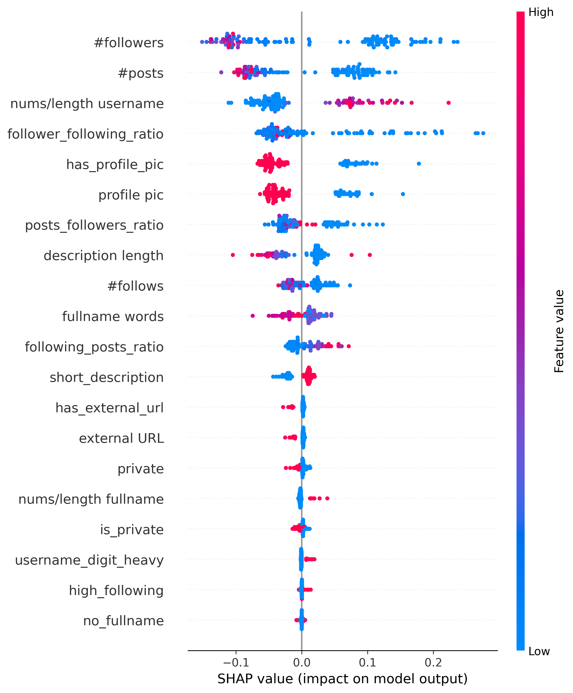

# Instagram Fake Account Detection

Machine learning system that detects fake Instagram accounts from profile metadata — ensemble methods, hyperparameter tuning, and explainable predictions via SHAP. Final year dissertation project, BSc Software Engineering, University of Greenwich (2025/26).

**Headline results: 93.23% ± 1.01% accuracy (5-fold CV, Random Forest) · AUC-ROC 0.9813 · FNR 5.17%**



## Project overview

Fake accounts are used for follower fraud, scams, and opinion manipulation. This project builds a full ML pipeline that classifies accounts as genuine or fake using 21 metadata features (engineered ratios, binary indicators — no content or network access required), and explains every prediction with SHAP so the "why" behind each classification is visible.

The pipeline covers the complete workflow: EDA → baseline → feature engineering → ensembling → SHAP analysis → hyperparameter tuning (GridSearch) → 5-fold cross-validation → error analysis. Each stage is a numbered script in `notebooks/`.

## Results

**5-fold cross-validation (primary evaluation):**

| Model | CV Mean | CV Std | CV Min | CV Max |
|-------|---------|--------|--------|--------|
| **Random Forest** | **93.23%** | **±1.01%** | 92.17% | 94.78% |
| Gradient Boosting | 91.67% | ±2.10% | 87.83% | 93.91% |
| Logistic Regression | 90.80% | ±3.17% | 87.83% | 96.52% |

**Single development split:**

| Model | Accuracy |
|-------|----------|
| Baseline (Gradient Boosting) | 89.66% |
| Random Forest | 90.52% |
| Neural Network (PyTorch) | 92.24% |
| Logistic Regression | 93.97% |
| Ensemble (soft voting) | 93.97% |

Logistic Regression and the Ensemble match Random Forest on the single split, yet **Random Forest is selected as the final model**: cross-validation averages over 5 different partitions and is a more reliable indicator of generalisation, and RF's variance (±1.01%) is three times lower than LR's (±3.17%) — it wins on stability, not on a lucky split.

**Held-out test set (Random Forest, tuned):**



- Test accuracy **91.38%** (106/116) — within the expected range of the CV estimate
- False Negative Rate **5.17%** (3 fake accounts missed) · False Positive Rate 12.07%
- The error asymmetry favours the practical use case: for platform moderation, letting a fake account slip through (FN) is costlier than flagging a real one for review (FP)

## Explainability

SHAP analysis identifies which features drive each prediction — follower/following ratios, profile completeness indicators, and username characteristics dominate:



Per-prediction waterfall plots (`results/shap_waterfall_example.png`) show the feature-by-feature reasoning for individual accounts, turning the model from a black box into something a moderation team could actually audit.

## Dataset

Public dataset of labelled genuine and fake Instagram profiles (metadata features only; no scraping, no personal content). Included in `data/` due to its small size; `download_dataset.py` fetches it from the original source for full reproducibility.

## Stack

Python 3.11 · scikit-learn · PyTorch · SHAP · pandas · matplotlib · pytest

## Structure

```
notebooks/            # Numbered pipeline stages
├── 01_EDA.py
├── 02_baseline.py
├── 03_feature_engineering.py
├── 04_ensemble.py
├── 05_shap.py
├── 06_hyperparameter_tuning.py
├── 07_cross_validation.py
└── 08_error_analysis.py
models/               # Trained models (RF, GB, ensemble, PyTorch NN)
results/              # All plots, CV results, tuned hyperparameters
tests/                # Unit tests (data processing, model training)
config.py             # Central configuration
utils.py              # Shared helpers
```

## Running it

```bash
pip install -r requirements.txt
python download_dataset.py        # or use the included data/
python notebooks/01_EDA.py        # stages run in order, 01 → 08
pytest                            # unit tests
```

---

**Author:** Vladyslav Danyliuk — BSc Software Engineering, University of Greenwich
[GitHub](https://github.com/VladDanyliuk)
